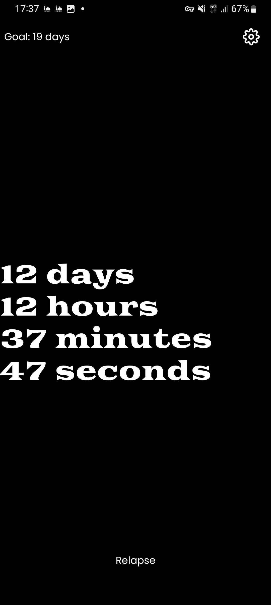
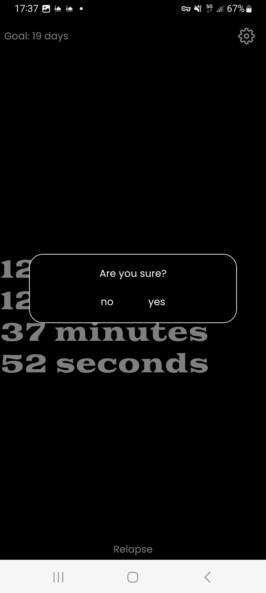

# Aurelius

an app to help you with your nofap journey

## Tech used:
-  React Native
-  Typescript
-  Redux

## TODO:

-  [  ]  fix the ui
-  [  ]  add more features (journal, ect...)
-  [  ]  fix the settings modal

this app is not using Expo

## Contributing

We welcome contributions from developers who want to help us improve this app. 

| :exclamation: the app is not ready for public use, it's still in the developement process |
| ------------------------------------------------------------------------------------------|

| :exclamation: this was tested only on Android |
| ----------------------------------------------|

MIT License
Copyright (c) 2023 duckduckcodes see the LICENSE.md file for details.
